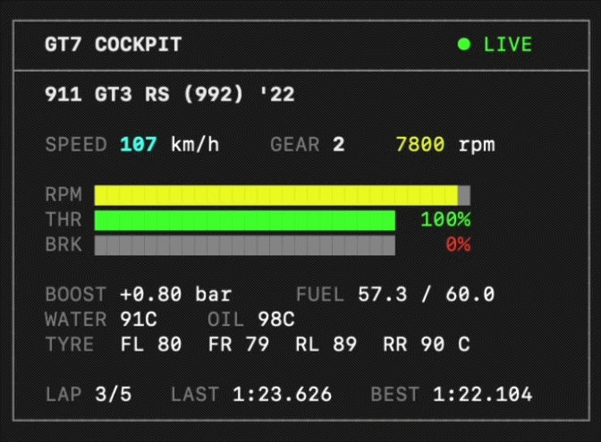

# gt7php

[](LICENSE)

> Gran Turismo 7 telemetry in your terminal, written in PHP.

Reads the live telemetry GT7 streams over UDP on the local network and paints a
cockpit in the terminal.

Why PHP? Why not.



## Features

- Live cockpit at ~15fps: speed, rpm, gear, boost, fuel, temps, lap times
- RPM bar shifts yellow near the shift point, red at the limiter
- Throttle and brake bars
- Pure PHP Salsa20 decryption, no external dependencies
- Ctrl+C to quit, cleanly

## Requirements

- PHP 8.1+ (`ext-sockets`, `ext-sodium`, `ext-mbstring`)
- Same network as the PS4/PS5
- GT7 running

## Quick Start

Grab the PlayStation IP from Settings → Network → Connection Status, then:

```bash
php tui.php 192.168.x.x
```

The `examples/` folder has smaller scripts, in order of how much they do:

| Script                          | What it does                         |
| ------------------------------- | ------------------------------------ |
| `php examples/connect.php <ip>` | proves the connection works          |
| `php examples/decrypt.php <ip>` | decrypts one packet and validates it |
| `php examples/read.php <ip>`    | dumps every parsed field once        |
| `php tui.php <ip>`              | the live cockpit                     |

## Car names

Telemetry only carries a numeric car id. Run the scraper the first time you set
up gt7php, and again whenever GT7 adds new cars, to build `data/cars.json`:

```bash
php tools/scrape-cars.php
```

Without it the cockpit just shows `Car #<id>`.

## How it works

GT7 streams telemetry over UDP. Send a heartbeat byte to port 33739 and the
console streams ~60 encrypted packets a second back to port 33740. Every packet
is Salsa20-encrypted and carries a fixed binary layout, decoded here into
speed, rpm, gear, temps, fuel, lap times and the rest.

## Documentation

Full docs are in [`docs/`](docs/README.md):

- [Architecture](docs/01-architecture/README.md): protocol, decryption, packet format, TUI rendering
- [Development](docs/02-development/README.md): getting started, scripts, car names

## License

MIT. See [LICENSE](LICENSE).
